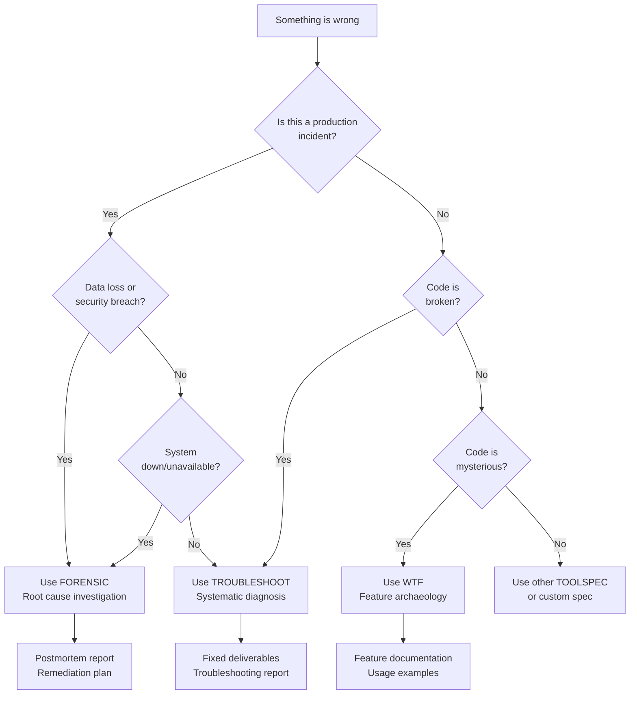

# TOOLSPEC Workflow Library

**Version:** 2.0  
**Last Updated:** 2 January 2026  
**Part of:** Constitutional Slow-Code Engine

---

## Quick Selection Guide

### I Need To...

**Build Something:**
- Create new feature with TDD → `Dev` (coming soon)
- Generate requirements → design → tasks → `SpecGen` (use Commander for now)
- Design system architecture → `Architecture` (coming soon)
- Set up automated testing → `Test` (coming soon)

**Fix Something:**
- Fix broken development code → **`Troubleshoot`** ✅ (available)
- Understand mysterious code → **`WTF`** ✅ (available)
- Investigate critical failure → **`Forensic`** ✅ (available)

**Improve Something:**
- Review code quality → `Review` (coming soon)
- Optimize performance → `Optimize` (coming soon)
- Enhance security → `Security` (coming soon)
- Innovate new features → `Innovate` (coming soon)
- Improve SPEC quality → **`Better_SPEC`** ✅ (available)

**Learn Something:**
- Research technologies → `Research` (coming soon)
- Learn through projects → `Learn` (coming soon)
- Analyze academic papers → `Paper` (coming soon)
- Landscape reconnaissance → `Recon` (coming soon)

**Document Something:**
- Create comprehensive documentation → `Docs` (coming soon)

**Integrate Something:**
- Connect systems/APIs → `Integrate` (coming soon)

---

## Currently Available TOOLSPECs

### ✅ Troubleshoot
**File:** `_TOOLSPECs/Troubleshoot/Troubleshoot_SPEC.md`

**Purpose:** Systematically diagnose and resolve post-development issues

**When to use:**
- Development project completed but deliverables don't work
- Tests fail or quality standards not met
- Definition of Complete criteria not achieved
- Non-critical bugs blocking project completion

**Outputs:**
- Fixed deliverables meeting original Definition of Complete
- Troubleshooting report with issues/fixes/verification
- Updated progress and notepad logs

**Time:** 2-4 hours depending on issue complexity

---

### ✅ WTF (What's This Feature)
**File:** `_TOOLSPECs/WTF/WTF_SPEC.md`

**Purpose:** Feature archaeology - understand mysterious/legacy code

**When to use:**
- Inherited legacy code with no documentation
- Code behaviour is unexpected or confusing
- Need to modify code but don't understand its purpose
- Building knowledge base for team onboarding

**Outputs:**
- Feature documentation (purpose, behaviour, dependencies)
- Code flow diagrams
- Usage examples
- Integration guide

**Time:** 1-4 hours depending on feature complexity

---

### ✅ Forensic (Root Cause Investigation)
**File:** `_TOOLSPECs/Forensic/Forensic_SPEC.md`

**Purpose:** Forensic analysis for critical production incidents

**When to use:**
- Production system crashed or became unavailable
- Data corruption or loss occurred
- Security breach detected
- Cascading failures across systems
- Financial loss or regulatory incident

**Outputs:**
- Postmortem report (timeline, root cause, remediation)
- Evidence archive with integrity checksums
- Prevention recommendations
- Action items with owners and deadlines

**Time:** 2-6 hours for thorough investigation

---

### ✅ Better_SPEC
**File:** `_TOOLSPECs/Better_SPEC/spec_Better_SPEC.md`

**Purpose:** Improve existing SPEC quality and constitutional compliance

**When to use:**
- SPEC validation fails frequently
- Need to improve task/step structure
- Want to add better backups or error handling
- Constitutional violations detected

**Outputs:**
- Improved SPEC files with better structure
- Compliance report
- Recommendations for future SPECs

**Time:** 1-2 hours per SPEC

---

### ✅ Dev_Analysis
**File:** `_TOOLSPECs/Dev_Analysis/Dev_Analysis_SPEC.md`

**Purpose:** Analyze development requirements and planning

**When to use:**
- Planning modifications to existing systems
- Need technical analysis before implementation
- Evaluating multiple approaches

**Outputs:**
- Technical analysis report
- Approach recommendations
- Implementation considerations

**Time:** 1-3 hours

---

## Troubleshooting Ecosystem Decision Tree



---

## Coming Soon TOOLSPECs

The following TOOLSPECs are planned based on Lia Workflow Specs integration:

### Development Category
- **Dev:** Feature implementation with TDD approach
- **SpecGen:** Transform ideas into requirements → design → tasks
- **Test:** Testing strategy and automation framework setup

### Quality Category  
- **Review:** Comprehensive code review and quality assessment
- **Architecture:** System architecture design and documentation
- **Security:** Security assessment and hardening recommendations
- **Optimize:** Performance optimization and bottleneck identification

### Research & Learning Category
- **Research:** Technology evaluation and proof-of-concept
- **Learn:** Project-based skill development and learning
- **Paper:** Academic paper analysis and critical review
- **Recon:** Strategic landscape reconnaissance and market analysis

### Knowledge & Strategy Category
- **Docs:** Comprehensive documentation generation
- **Innovate:** Creative innovation and feature enhancement ideation
- **Integrate:** System integration and API development planning

---

## TOOLSPEC Selection Matrix

| Your Situation | Recommended TOOLSPEC | Alternative |
|----------------|---------------------|-------------|
| Production is down | **Forensic** | Then Troubleshoot for fixes |
| Dev project broken | **Troubleshoot** | WTF if code unclear |
| Don't understand code | **WTF** | Dev_Analysis if planning changes |
| Planning new feature | Dev (coming soon) | Commander + custom spec |
| Need code review | Review (coming soon) | Better_SPEC for SPEC review |
| System is slow | Optimize (coming soon) | Dev_Analysis |
| Security concern | Security (coming soon) | Forensic if breach occurred |
| Learning new tech | Learn (coming soon) | Research + custom spec |
| Need documentation | Docs (coming soon) | Manual documentation |

---

## How to Use a TOOLSPEC

### Method 1: Direct Execution (Recommended)

1. Navigate to TOOLSPEC directory:
```bash
cd __SPEC_Engine/_TOOLSPECs/[TOOLSPEC_NAME]/
```

2. Launch the specification:
- Open `[TOOLSPEC_NAME]_SPEC.md` in your AI assistant
- Provide required context when prompted
- Follow execution flow

3. Review outputs:
- `progress_[TOOLSPEC].json` - Machine-readable execution log
- `notepad_[TOOLSPEC].md` - Human-readable insights
- Deliverables specified in "Definition of Complete"

### Method 2: Commander Generation (Custom Specs)

For workflows not covered by existing TOOLSPECs:

1. Use Commander to generate custom spec:
```bash
cd __SPEC_Engine/_Commander_SPEC/
# Open Spec_Commander.md with your goal
```

2. Commander will:
- Analyze your goal
- Recommend relevant MCP tools
- Generate triple-file spec (spec.md, parameters.toml, exe.md)
- Create in appropriate DNA folder

---

## TOOLSPEC File Structure

Every TOOLSPEC follows the standard structure:

```
_TOOLSPECs/[NAME]/
├── [NAME]_SPEC.md              # Human-readable specification
├── parameters_[NAME].toml      # Machine-readable configuration
├── exe_[NAME].md               # Execution controller
├── [NAME]_QUICK_REFERENCE.md   # Quick start guide (optional)
└── README.md                   # Detailed documentation (optional)
```

**During execution, generated:**
```
├── progress_[NAME].json        # Execution log
└── notepad_[NAME].md           # Knowledge capture
```

---

## TOOLSPEC vs Custom SPEC

**Use TOOLSPEC when:**
- Your workflow matches a pre-built pattern
- You want faster time-to-value
- You benefit from battle-tested structure
- You want consistent approaches across team

**Use Custom SPEC when:**
- Novel workflow not covered by TOOLSPECs
- Highly specialized domain requirements
- Combining multiple workflow patterns
- Prototyping new workflow approaches

**Both use the same underlying framework:**
- Constitutional governance (Articles I-XV)
- Triple-file architecture (spec.md + parameters.toml + exe.md)
- Dynamic mode with intelligent escalation
- Knowledge capture (notepad.md)
- Error propagation and backup methods

---

## Contributing New TOOLSPECs

Want to add a TOOLSPEC to the library?

### Requirements

1. **Constitutional Compliance:**
   - Follows Articles I-XV
   - Singular goal (Article I)
   - Proper hierarchy: Goal → Task → Step → Backup (Article II)
   - Triple-file architecture (Article III)

2. **Documentation:**
   - Complete SPEC.md with bridging
   - Valid parameters.toml
   - Customized exe.md (or reference to template)
   - Quick reference guide
   - Real-world testing completed

3. **Utility:**
   - Solves common workflow pattern
   - Reduces time-to-value vs custom spec
   - Provides reusable structure
   - Documented with examples

### Submission Process

1. Create TOOLSPEC in your local `_TOOLSPECs/` directory
2. Test thoroughly on real projects
3. Document usage examples and outcomes
4. Submit for community review
5. After approval, added to official library

---

## Integration with Education Mode

All TOOLSPECs support Education Mode (Article XV) for learning:

Enable in parameters.toml:
```toml
[execution]
default_mode = "education"

[education]
enabled = true
approval_gates = "increased"
rationale_required = true
alternatives_shown = true
comparison_depth = "detailed"
learning_pace = "moderate"
```

**Benefits:**
- Understand WHY decisions are made
- See alternative approaches with trade-offs
- Build knowledge for future autonomous execution
- Great for onboarding or learning new patterns

---

## Roadmap

### v2.1 (Q1 2026)
- [ ] Dev TOOLSPEC (feature implementation)
- [ ] Review TOOLSPEC (code review)
- [ ] Research TOOLSPEC (technology evaluation)

### v2.2 (Q2 2026)
- [ ] Architecture TOOLSPEC (system design)
- [ ] Security TOOLSPEC (security assessment)
- [ ] Optimize TOOLSPEC (performance)
- [ ] Test TOOLSPEC (testing automation)

### v2.3 (Q2 2026)
- [ ] Learn TOOLSPEC (project-based learning)
- [ ] Paper TOOLSPEC (academic analysis)
- [ ] Docs TOOLSPEC (documentation)
- [ ] Innovate TOOLSPEC (feature ideation)
- [ ] Integrate TOOLSPEC (system integration)
- [ ] Recon TOOLSPEC (landscape analysis)

### Community Contributions
- Additional domain-specific TOOLSPECs welcome
- Improvements to existing TOOLSPECs encouraged
- Real-world usage examples valuable

---

## Support

- **Documentation:** See individual TOOLSPEC README files
- **Issues:** Review SPEC validation errors in progress.json
- **Learning:** Use Education Mode for understanding
- **Community:** Share TOOLSPEC improvements and patterns

---

## Related Documentation

- **Constitution:** `__SPEC_Engine/_Constitution/constitution.md`
- **Design Philosophy:** `__SPEC_Engine/_Constitution/DESIGN_PHILOSOPHY.md`
- **Templates:** `__SPEC_Engine/_templates/`
- **Commander:** `__SPEC_Engine/_Commander_SPEC/Spec_Commander.md`
- **Main README:** `__SPEC_Engine/README.md`

---

**Last Updated:** 2 January 2026  
**Library Version:** 2.0  
**Available TOOLSPECs:** 5 (Troubleshoot, WTF, Forensic, Better_SPEC, Dev_Analysis)  
**Coming Soon:** 13 additional TOOLSPECs
