# Pattern-Informed SPEC Development: Complete Workflow

**Date:** 7 January 2026  
**Status:** Production Ready  
**Version:** 1.0

---

## Visual Workflow Diagram

```mermaid
flowchart TD
    Start([User: I have a project idea]) --> Setup{Knowledge Base<br/>Exists?}
    
    Setup -->|No| Phase1[PHASE 1: Build Knowledge Base]
    Setup -->|Yes| Phase2Start[PHASE 2: Create SPEC]
    
    Phase1 --> Describe[Describe Project Domain<br/>via Web UI]
    Describe --> AIAnalysis[AI Suggests Topics<br/>& Search Queries]
    AIAnalysis --> UserReview[User Reviews<br/>& Confirms]
    UserReview --> Extract[Extract Patterns<br/>from GitHub]
    Extract --> GenerateEmbed[Generate Embeddings<br/>Gemini API]
    GenerateEmbed --> VectorIndex[Create Vector Index<br/>Neo4j]
    VectorIndex --> Phase1Complete([Knowledge Base Ready])
    
    Phase1Complete --> Phase2Start
    
    Phase2Start --> UserGoal[User Describes Goal<br/>Natural Language]
    UserGoal --> SemanticQuery[Semantic Search<br/>Vector Similarity]
    SemanticQuery --> HybridFilter[Hybrid Filtering<br/>Tech + Stars + Confidence]
    HybridFilter --> ScoreRank[Confidence Scoring<br/>Rank Top 5]
    ScoreRank --> DisplayPatterns[Display Patterns<br/>to User]
    
    DisplayPatterns --> UserSelect{User<br/>Selection}
    UserSelect -->|Select Pattern| LoadPattern[Load Pattern Context]
    UserSelect -->|Skip| NoPattern[Proceed Without Pattern]
    
    LoadPattern --> FindBackups[Find Similar Patterns<br/>for Backups]
    FindBackups --> GenerateSPEC[Generate SPEC<br/>Pattern-Informed]
    NoPattern --> GenerateSPEC
    
    GenerateSPEC --> ValidateFeasibility[Pattern Feasibility<br/>Validation]
    ValidateFeasibility --> ValidationResult{Validation<br/>Result}
    
    ValidationResult -->|Pass| SaveSPEC[Save SPEC<br/>TOML File]
    ValidationResult -->|Issues| ReviewIssues[Review Alignment<br/>Issues]
    ReviewIssues --> AdjustSPEC[Adjust SPEC<br/>Requirements]
    AdjustSPEC --> ValidateFeasibility
    
    SaveSPEC --> Phase2Complete([SPEC Ready])
    
    Phase2Complete --> Phase3Start[PHASE 3: Execute SPEC]
    Phase3Start --> LoadSPEC[Load SPEC + Pattern Context]
    LoadSPEC --> TaskLoop[For Each Task]
    
    TaskLoop --> ShowGuidance[Show Pattern Guidance<br/>- Proven Approach<br/>- Common Pitfalls<br/>- Reference Code]
    ShowGuidance --> LLMImplement[LLM Implements<br/>Following Pattern]
    LLMImplement --> ValidateStep[Validate Against<br/>Pattern]
    
    ValidateStep --> StepResult{Step<br/>Success?}
    StepResult -->|Yes| NextTask{More<br/>Tasks?}
    StepResult -->|Issues| SuggestBackup[Suggest Backup<br/>from Similar Patterns]
    SuggestBackup --> UserChoose{User<br/>Chooses}
    UserChoose -->|Apply Backup| LLMImplement
    UserChoose -->|Continue| LLMImplement
    
    NextTask -->|Yes| TaskLoop
    NextTask -->|No| Phase3Complete([Implementation Complete])
    
    Phase3Complete --> Phase4[PHASE 4: Validate & Learn]
    Phase4 --> FinalValidation[Final Pattern<br/>Alignment Check]
    FinalValidation --> ValidationReport[Generate Validation<br/>Report]
    ValidationReport --> UserFeedback[User Provides<br/>Feedback]
    UserFeedback --> UpdateKB[Update Knowledge Base<br/>Learning Loop]
    UpdateKB --> End([Project Complete])
    
    style Start fill:#e1f5ff
    style End fill:#d4edda
    style Phase1 fill:#fff3cd
    style Phase2Start fill:#cfe2ff
    style Phase3Start fill:#f8d7da
    style Phase4 fill:#d1ecf1
    style Phase1Complete fill:#d4edda
    style Phase2Complete fill:#d4edda
    style Phase3Complete fill:#d4edda
```



---

## Overview

This workflow represents the complete end-to-end journey from building a knowledge base of architectural patterns to executing production-ready SPECs informed by those proven patterns. The system integrates semantic search, confidence scoring, and pattern validation to guide users through architectural decisions.

### Workflow Philosophy

**Traditional Approach (Reactive):**
```
User Goal → Generate SPEC → Trial & Error → Debug → Refactor → Maybe Works
```

**Pattern-Informed Approach (Proactive):**
```
User Goal → Query Patterns → Select → Pattern-Informed SPEC → Validated Implementation → Production
```

---

## Phase 1: Build Knowledge Base (One-Time Setup)

### Purpose
Populate the Neo4j knowledge graph with architectural patterns extracted from successful GitHub repositories.

### Steps

#### 1. Describe Project Domain
**User Action:** Open web UI and describe project in natural language

**Input:**
- Natural language project description
- Technologies of interest
- Optional domains

**Output:** AI-analyzed context for pattern extraction

**Time:** 2 minutes

---

#### 2. AI Suggests Topics & Search Queries
**System Action:** Gemini analyses description and generates:
- GitHub topics relevant to project
- Optimized search queries with star filters
- Domain organization structure

**Technology:** Gemini API (text generation)

**Time:** 1 minute

---

#### 3. User Reviews & Confirms
**User Action:** Review suggestions and click "Run Extraction Now"

**Decision Point:** User can modify or accept AI recommendations

**Time:** 1 minute

---

#### 4. Extract Patterns from GitHub
**System Action:** 
- Query GitHub API with generated searches
- Fetch README/documentation
- Extract architectural patterns using Gemini
- Detect and merge duplicates
- Store in Neo4j graph database

**Data Stored:**
- Pattern name and description
- Architectural reasoning
- Technology stack
- Constraints and requirements
- GitHub stars and URL
- Confidence level

**Time:** 5-15 minutes (depends on number of repos)

---

#### 5. Generate Embeddings
**System Action:** Generate 768-dimensional vectors using Gemini text-embedding-004

**Features:**
- File-based caching (reduces API costs)
- Batch processing
- Rate limiting (60 req/min)

**Performance:** 
- Cached: 5-15ms per embedding
- New: 30-80ms per embedding

**Time:** 30 seconds - 2 minutes

---

#### 6. Create Vector Index
**System Action:** Create Neo4j vector index for semantic search

**Technology:** Neo4j 5.x vector capabilities

**Output:** ONLINE index ready for queries

**Time:** 10 seconds

---

### Phase 1 Outputs
- Populated knowledge graph with patterns
- 768-dimensional vector embeddings
- Indexed database ready for semantic queries

**Total Time:** ~20 minutes (one-time setup)

---

## Phase 2: Create SPEC (Pattern-Informed)

### Purpose
Generate a SPEC informed by proven architectural patterns from the knowledge graph.

### Steps

#### 1. User Describes Goal
**User Action:** Input project goal in natural language

**Example:** "Build a real-time financial dashboard"

**Format:** Conversational, no technical jargon required

**Time:** 30 seconds

---

#### 2. Semantic Search
**System Action:** 
- Embed user goal (768-dimensional vector)
- Vector similarity search in Neo4j
- Retrieve top 20 candidate patterns

**Technology:** Neo4j vector index query

**Performance:** 40-90ms query execution

---

#### 3. Hybrid Filtering
**System Action:** Apply structural filters to semantic results

**Filters Applied:**
- Technology constraints (if specified)
- Minimum GitHub stars
- Minimum confidence level
- Deployment type
- Domain alignment

**Algorithm:** Semantic results → Graph traversal filters → Narrowed candidates

---

#### 4. Confidence Scoring
**System Action:** Calculate composite score for each pattern

**Formula:** 
```
composite_score = 0.4 × semantic_similarity + 0.3 × pattern_confidence + 0.3 × normalized_stars
```

**Scoring Components:**
- **Semantic similarity:** 0-1 (from vector search)
- **Pattern confidence:** high=1.0, medium=0.7, low=0.4
- **GitHub stars:** Normalized (max at 50,000 stars = 1.0)

**Output:** Ranked patterns with recommendation level (high/medium/low)

---

#### 5. Display Patterns to User
**System Action:** Format top 5 patterns for review

**Display Includes:**
- Pattern name and description
- Confidence level and composite score
- GitHub stars and repository URL
- Reasoning for recommendation
- Technology stack
- Score breakdown (semantic, confidence, stars)

**Time for user review:** 1-2 minutes

---

#### 6. User Selection
**Decision Point:** User chooses one of:
- Select pattern by number (1-5)
- Skip pattern guidance
- Request more alternatives

**User Consideration Factors:**
- Team expertise with technologies
- GitHub stars (proven success indicator)
- Semantic relevance to goal
- Technology stack alignment

---

#### 7. Load Pattern Context (if selected)
**System Action:** Retrieve full pattern details

**Pattern Context Includes:**
- Architectural approach
- Proven technologies with versions
- Common constraints
- Reference implementation URL
- Known issues from GitHub

---

#### 8. Find Similar Patterns for Backups
**System Action:** Vector similarity search for 3-5 similar patterns

**Purpose:** Provide backup approaches if primary pattern encounters issues

**Threshold:** Minimum 0.5 similarity score

---

#### 9. Generate SPEC
**System Action:** Create SPEC with pattern guidance

**SPEC Components:**
- **Goal:** User's objective
- **Software Stack:** Pattern-recommended technologies
- **Tasks:** Broken down following pattern architecture
- **Steps:** Detailed actions with pattern-proven approaches
- **Backups:** Alternative methods from similar patterns
- **Risk Assessment:** Based on pattern confidence

**Context Provided to LLM:**
- Selected pattern details
- Backup patterns
- Architectural guidance
- Technology recommendations
- Risk level

**Time:** 10-15 seconds (generation)

---

#### 10. Pattern Feasibility Validation
**System Action:** Validate SPEC against pattern constraints

**Validation Checks:**
- Technology alignment (SPEC vs pattern tech stack)
- Architecture alignment (approach matches pattern)
- Constraint satisfaction (requirements within pattern capabilities)
- Deployment target compatibility

**Output:** Pass/fail with detailed alignment report

**Time:** 2-3 seconds (validation)

---

#### 11. Save SPEC
**System Action:** Write SPEC to TOML file with pattern metadata

**Metadata Included:**
- Pattern name and confidence score
- Pattern reference URL
- Backup pattern references
- Risk assessment
- Validation results

---

### Phase 2 Outputs
- Pattern-informed SPEC (TOML file)
- Pattern metadata for execution guidance
- Backup approaches documented
- Risk assessment completed

**Total Time:** ~10 minutes

---

## Phase 3: Execute SPEC (Pattern-Guided)

### Purpose
Execute SPEC with LLM assistance, guided by pattern knowledge and common pitfalls.

### Steps

#### 1. Load SPEC + Pattern Context
**System Action:** 
- Parse SPEC TOML file
- Load pattern metadata
- Retrieve reference implementation details
- Load backup patterns

**Context Available:** Full pattern guidance for each task

---

#### 2. For Each Task Loop
**System Action:** Iterate through SPEC tasks sequentially

**Task Context Provided:**
- Task objective
- Pattern-proven approach
- Reference code snippets (from GitHub)
- Common pitfalls (from pattern issues)
- Backup methods (from similar patterns)

---

#### 3. Show Pattern Guidance
**Display to User/LLM:**
- Proven approach from reference implementation
- Common pitfalls with solutions (from GitHub issues)
- Technology versions tested with pattern
- Best practices specific to this task

**Purpose:** Prevent known issues proactively

---

#### 4. LLM Implements Following Pattern
**System Action:** LLM generates code following pattern guidance

**LLM Context Includes:**
- Pattern architectural approach
- Reference implementation structure
- Known pitfall avoidance strategies
- Technology-specific best practices

**Mode:** Pattern-informed implementation vs blind generation

**Time per task:** 5-15 minutes (LLM-assisted)

---

#### 5. Validate Against Pattern
**System Action:** Compare implementation with pattern structure

**Validation Checks:**
- Code structure matches pattern
- Key components present (e.g., connection manager, cleanup handlers)
- Best practices followed (e.g., error handling, logging)
- Pattern-specific requirements met

**Output:** Alignment percentage and specific issues if any

---

#### 6. Step Success Check
**Decision Point:** Implementation validated successfully?

**Outcomes:**
- **Success:** Continue to next task
- **Issues:** Suggest backup approach from similar patterns

---

#### 7. Suggest Backup (if issues)
**System Action:** Present backup approaches from similar patterns

**Backup Options Include:**
- Alternative pattern with different approach
- Confidence level of backup
- Trade-offs vs primary approach
- Implementation differences

**User Choice:** Apply backup, continue with primary, or manual intervention

**Time if backup needed:** +10-20 minutes

---

#### 8. Next Task Check
**Decision Point:** More tasks in SPEC?

**Outcomes:**
- **Yes:** Loop back to show guidance for next task
- **No:** Implementation complete

---

### Phase 3 Outputs
- Working implementation following proven pattern
- Pattern-validated code structure
- Known pitfalls avoided
- Reference implementation for comparison

**Total Time:** 2-4 hours (vs 8-12 hours unguided)

---

## Phase 4: Validate & Learn (Continuous Improvement)

### Purpose
Validate final implementation against pattern and contribute learnings back to knowledge base.

### Steps

#### 1. Final Pattern Alignment Check
**System Action:** Comprehensive validation of implementation

**Validation Areas:**
- Architecture alignment (REST endpoints, WebSocket structure, etc.)
- Technology stack (versions and configurations)
- Deviations from pattern (improvements or issues)
- Pattern fidelity percentage

**Output:** Detailed alignment report

**Time:** 30 seconds

---

#### 2. Generate Validation Report
**System Action:** Create report showing:
- Overall pattern fidelity (percentage)
- Specific alignments and deviations
- Risk assessment for production
- Production readiness estimate

**Format:** Structured report for user review

---

#### 3. User Provides Feedback
**User Action:** Answer feedback questions

**Feedback Questions:**
- Pattern relevance to goal (1-5 rating)
- Time savings vs unguided development
- Issues encountered with pattern
- Improvements made that could help others

**Purpose:** Train confidence scorer and improve recommendations

**Time:** 2-3 minutes (optional)

---

#### 4. Update Knowledge Base
**System Action:** Store feedback for learning

**Learning Loop:**
- Adjust pattern confidence scores based on success
- Identify pattern quality issues
- Suggest pattern updates
- Train semantic search relevance

**Purpose:** Continuous improvement of recommendations

---

### Phase 4 Outputs
- Validation report
- User feedback stored
- Knowledge base updated with learnings
- Confidence scores adjusted

**Total Time:** ~5 minutes

---

## System Components & Technologies

### Knowledge Graph
- **Database:** Neo4j 5.22+ (vector support)
- **Pattern Storage:** Graph nodes with properties
- **Relationships:** USES, REQUIRES, SOLVED_BY
- **Vector Index:** 768-dimensional embeddings

### Semantic Search
- **Embedding Model:** Gemini text-embedding-004
- **Dimensions:** 768
- **Caching:** File-based (pattern_embeddings.json)
- **Index Type:** Neo4j vector index

### Confidence Scoring
- **Algorithm:** Weighted composite score
- **Weights:** 40% semantic, 30% confidence, 30% stars
- **Normalization:** Stars capped at 50,000 for max score
- **Output:** Score 0-1, mapped to high/medium/low

### Query System
- **Hybrid Approach:** Semantic search → structural filters
- **Expansion Factor:** 4x (retrieve 20 for top 5 results)
- **Filtering:** Technology, deployment, stars, confidence, domain
- **Performance:** 120-180ms end-to-end hybrid query

### Pattern Extraction
- **Source:** GitHub API
- **Analysis:** Gemini AI (README/docs analysis)
- **Duplicate Detection:** Semantic similarity + tech overlap
- **Quality Scoring:** Based on documentation, stars, activity

---

## Performance Characteristics

### Query Performance
| Operation | Performance |
|-----------|-------------|
| Embedding (cached) | 5-15ms |
| Embedding (new) | 30-80ms |
| Vector search | 40-90ms |
| Hybrid query | 120-180ms |

### Test Coverage
- **Total tests:** 32
- **Pass rate:** 100%
- **Test categories:**
  - Phase 1: Vector search (5 tests)
  - Phase 2: Hybrid queries (6 tests)
  - Phase 3: Commander integration (14 tests)
  - Phase 4: Backwards compatibility (7 tests)

### Code Quality
- **Coverage:** 85%+ for commander_integration.py
- **Type safety:** TypedDict definitions for all complex types
- **Logging:** Structured logging with metadata
- **Error handling:** Graceful degradation when Neo4j unavailable

---

## Key Decision Points

### 1. Knowledge Base Setup (Phase 1)
- **Decision:** Build knowledge base or skip?
- **One-time cost:** ~20 minutes
- **Future benefit:** Every SPEC leverages patterns

### 2. Pattern Selection (Phase 2)
- **Decision:** Use pattern guidance or proceed unguided?
- **Factors:** Team expertise, pattern confidence, technology stack
- **Impact:** HIGH on success probability

### 3. Pattern Validation (Phase 2)
- **Decision:** Accept SPEC or adjust requirements?
- **Trigger:** Validation fails (tech/architecture misalignment)
- **Action:** Review and adjust SPEC constraints

### 4. Backup Application (Phase 3)
- **Decision:** Apply backup approach or continue with primary?
- **Trigger:** Step validation issues
- **Options:** Alternative pattern, continue primary, manual fix

### 5. Feedback Provision (Phase 4)
- **Decision:** Provide feedback or skip?
- **Benefit:** Improves future recommendations
- **Time cost:** 2-3 minutes (optional)

---

## Data Flow

### Pattern Extraction Flow
```
GitHub API → README/Docs → Gemini Analysis → Pattern Object → Neo4j Storage → Embedding Generation → Vector Index
```

### Pattern Query Flow
```
User Goal → Embedding → Vector Search (Neo4j) → Candidates → Structural Filters → Confidence Scoring → Ranked Results → User Display
```

### SPEC Generation Flow
```
User Selection → Pattern Context → Similar Patterns → Pattern-Informed SPEC Generation → Feasibility Validation → TOML File
```

### Execution Flow
```
SPEC TOML → Task Loop → Pattern Guidance → LLM Implementation → Pattern Validation → Success/Backup Decision → Next Task
```

### Learning Flow
```
User Feedback → Confidence Score Adjustment → Pattern Quality Update → Knowledge Base Update → Improved Future Recommendations
```

---

## Error Handling & Graceful Degradation

### Graceful Degradation Scenarios

#### 1. Neo4j Unavailable
- System continues without pattern guidance
- Returns empty pattern results
- SPEC generation proceeds unguided
- User notified of degraded mode

#### 2. Gemini API Failure
- Uses cached embeddings if available
- Falls back to structural queries only
- Notifies user of limited capabilities

#### 3. Pattern Not Found
- Offers cross-pattern discovery
- Suggests alternative search terms
- Option to proceed without pattern

#### 4. Validation Failures
- Provides detailed alignment issues
- Suggests adjustments to requirements
- Offers backup patterns

### Error Recovery Strategies

- **Connection Errors:** Retry with exponential backoff
- **API Rate Limits:** Respects limits, queues requests
- **Invalid Inputs:** Clear error messages with valid options
- **Missing Data:** Graceful fallback to defaults

---

## Workflow Advantages

### Traditional SPEC Development (Unguided)
- Start from scratch
- Trial and error approach
- Discover issues during implementation
- Refactor based on problems encountered
- Uncertain success probability

### Pattern-Informed SPEC Development
- Start from proven patterns
- Guided by battle-tested approaches
- Known issues avoided proactively
- Backup approaches ready
- High success probability based on pattern confidence

---

## Implementation Files

### Core Files
- `commander_integration.py` - CommanderPatternInterface class
- `pattern_query_interface_semantic.py` - Semantic query interface
- `confidence_scorer.py` - Composite scoring algorithm
- `hybrid_query_builder.py` - Query composition engine
- `embedding_generator.py` - Gemini API wrapper

### Test Files
- `test_commander_integration.py` - 14 integration tests
- `test_backwards_compatibility.py` - 7 compatibility tests
- `test_hybrid_queries.py` - 6 hybrid query tests
- `test_vector_search.py` - 5 vector search tests

### Documentation
- `VECTOR_ARCHITECTURE.md` - Technical specification
- `SEMANTIC_QUERY_COOKBOOK.md` - Common patterns
- `COMMANDER_INTEGRATION_GUIDE.md` - Integration guide
- `QUICKSTART_SEMANTIC.md` - 5-minute setup
- `IMPLEMENTATION_COMPLETE_SUMMARY.md` - Status report

---

## Conclusion

This workflow represents a complete transformation from **reactive** (fix problems as they arise) to **proactive** (avoid problems using proven patterns) SPEC development methodology.

The pattern-informed approach enables developers to:
- Leverage proven architectural patterns
- Avoid known pitfalls proactively
- Build with higher confidence
- Reduce development time significantly
- Learn from successful implementations

**Status:** Production ready with comprehensive test coverage and validated backwards compatibility.

---

**Created:** 7 January 2026  
**Version:** 1.0  
**Maintained by:** SPEC Engine Team
