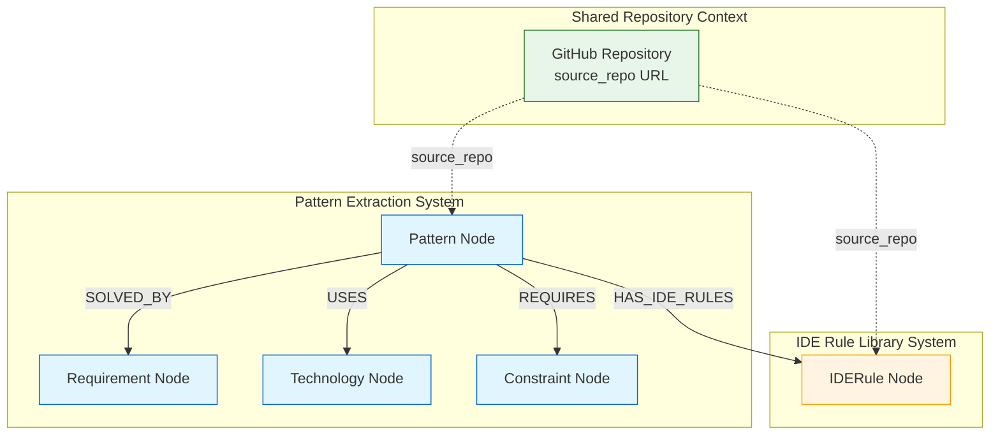
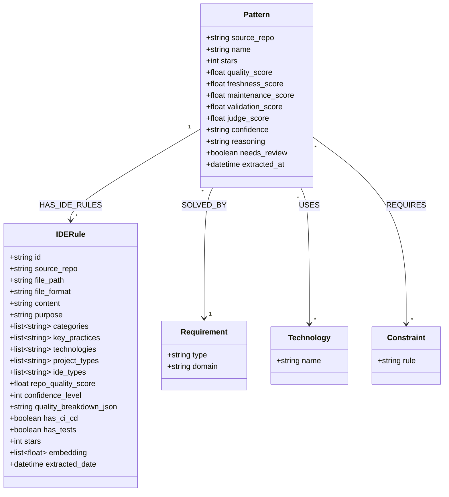

# Pattern-IDERule Integration Documentation

**Integration between Pattern Extraction Pipeline and IDE Rule Library**

**Last Updated:** 8 January 2026  
**Status:** Design Complete | Implementation Pending

---

## Overview

This document describes the integration between two independent knowledge graph systems:
- **Pattern Extraction Pipeline**: Extracts architectural patterns from GitHub repos
- **IDE Rule Library**: Extracts and scores IDE coding rules from repos

Both systems share the same Neo4j database and are linked via repository URLs and direct relationships.

---

## Architecture Diagram



---

## Data Model



### Node Types

#### Pattern Node

**Purpose:** Represents architectural patterns extracted from repositories

**Properties:**
- `source_repo` (string) - GitHub repository URL (unique identifier)
- `name` (string) - Pattern name
- `stars` (int) - Repository stars
- `quality_score` (float) - Multi-dimensional quality score (0-100 scale)
- `freshness_score` (float) - Maintenance activity score (0-100 scale)
- `maintenance_score` (float) - Maintenance quality score (0-100 scale)
- `validation_score` (float) - Pattern validation score
- `judge_score` (float) - LLM judge quality score
- `confidence` (string) - Extraction confidence (high/medium/low)
- `reasoning` (string) - Why this pattern is useful
- `needs_review` (boolean) - Requires manual review
- `extracted_at` (datetime) - Extraction timestamp

**System:** `pattern_extraction_pipeline/`

#### IDERule Node

**Purpose:** Represents IDE coding rules and configurations from repositories

**Properties:**
- `id` (string) - Unique identifier (repo:filepath)
- `source_repo` (string) - GitHub repository URL
- `file_path` (string) - Path to rule file in repo
- `file_format` (string) - Rule file type (.cursorrules, CLAUDE.md, etc.)
- `content` (string) - Full rule content
- `purpose` (string) - What these rules do (Gemini-analyzed)
- `categories` (list[string]) - Rule categories
- `key_practices` (list[string]) - Main practices
- `technologies` (list[string]) - Tech stack
- `project_types` (list[string]) - Project types (api, web_app, etc.)
- `ide_types` (list[string]) - IDE types (cursor, vscode, etc.)
- `repo_quality_score` (float) - 7-factor repo quality score (0-100)
- `confidence_level` (int) - Confidence level (1-5)
- `quality_breakdown_json` (string) - Detailed quality metrics
- `has_ci_cd` (boolean) - Has CI/CD signals
- `has_tests` (boolean) - Has test signals
- `stars` (int) - Repository stars (DEPRECATED - get from Pattern instead)
- `embedding` (list[float]) - Semantic embedding (768-dim)
- `extracted_date` (datetime) - Extraction timestamp

**System:** `ide_rule_library/`

---

## Relationships

### HAS_IDE_RULES

**Direction:** Pattern → IDERule

**Cardinality:** One-to-Many (one Pattern can link to multiple IDERule nodes)

**Purpose:** Links architectural patterns to their actual IDE configuration files

**Properties:** None (simple relationship)

**Created:** Automatically during pattern extraction when IDE rule files are detected

**Example:**
```cypher
CREATE (p:Pattern {source_repo: 'https://github.com/owner/repo'})
CREATE (r:IDERule {id: 'owner/repo:.cursorrules', source_repo: 'https://github.com/owner/repo'})
CREATE (p)-[:HAS_IDE_RULES]->(r)
```

---

## Integration Points

### 1. Shared Repository Context

Both systems reference the same `source_repo` URL (GitHub repository):

```cypher
// Find both Pattern and Rules from same repo
MATCH (p:Pattern {source_repo: $repo_url})
MATCH (r:IDERule {source_repo: $repo_url})
RETURN p, r
```

### 2. Direct Relationship

Pattern nodes are directly linked to their IDERule nodes:

```cypher
// Find Pattern with its IDE rules
MATCH (p:Pattern)-[:HAS_IDE_RULES]->(r:IDERule)
RETURN p, r
```

### 3. Quality Cross-Reference

Both systems calculate quality scores independently (both on 0-100 scale):
- **Pattern Quality** (`quality_score`): Multi-dimensional (popularity, maintenance, maturity, community)
- **Rule Quality** (`repo_quality_score`): 7-factor (star velocity, freshness, issue health, diversity, production signals, docs, usage)

```cypher
// Compare pattern and rule quality (both 0-100 scale)
MATCH (p:Pattern)-[:HAS_IDE_RULES]->(r:IDERule)
RETURN p.source_repo,
       p.quality_score as pattern_quality,
       avg(r.repo_quality_score) as avg_rule_quality,
       abs(p.quality_score - avg(r.repo_quality_score)) as quality_diff
ORDER BY quality_diff DESC
```

---

## Query Examples

### Basic Queries

#### Find Pattern with its IDE Rules

```cypher
MATCH (p:Pattern {source_repo: 'https://github.com/owner/repo'})-[:HAS_IDE_RULES]->(r:IDERule)
RETURN p.name, r.file_path, r.file_format, r.repo_quality_score
```

#### Find All Patterns with IDE Rules

```cypher
MATCH (p:Pattern)-[:HAS_IDE_RULES]->(r:IDERule)
RETURN p.name, count(r) as rule_count
ORDER BY rule_count DESC
```

#### Find Patterns Without IDE Rules

```cypher
MATCH (p:Pattern)
WHERE NOT (p)-[:HAS_IDE_RULES]->(:IDERule)
RETURN p.name, p.source_repo
```

### Quality-Based Queries

#### Find Patterns with High-Quality IDE Rules

```cypher
MATCH (p:Pattern)-[:HAS_IDE_RULES]->(r:IDERule)
WHERE r.repo_quality_score > 60 AND r.confidence_level >= 3
RETURN p.name, r.file_format, r.repo_quality_score, r.confidence_level
ORDER BY r.repo_quality_score DESC
```

#### Find Top-Quality Patterns with Verified Rules

```cypher
MATCH (p:Pattern)-[:HAS_IDE_RULES]->(r:IDERule)
WHERE p.quality_score > 70 AND r.repo_quality_score > 60
RETURN p.name, p.quality_score, collect(r.file_format) as rule_formats
ORDER BY p.quality_score DESC
LIMIT 10
```

#### Cross-Reference Quality Scores

```cypher
MATCH (p:Pattern)-[:HAS_IDE_RULES]->(r:IDERule)
WITH p, avg(r.repo_quality_score) as avg_rule_quality, count(r) as rule_count
RETURN p.source_repo,
       p.quality_score as pattern_quality,
       avg_rule_quality,
       rule_count,
       CASE 
         WHEN p.quality_score > 70 AND avg_rule_quality > 60 THEN 'High Trust'
         WHEN p.quality_score > 50 AND avg_rule_quality > 40 THEN 'Medium Trust'
         ELSE 'Low Trust'
       END as trust_level
ORDER BY pattern_quality DESC, avg_rule_quality DESC
```

### Technology & Context Queries

#### Find Patterns with Rules for Specific Technologies

```cypher
MATCH (p:Pattern)-[:USES]->(t:Technology {name: 'python'})
MATCH (p)-[:HAS_IDE_RULES]->(r:IDERule)
WHERE 'python' IN r.technologies
RETURN p.name, r.file_format, r.purpose
```

#### Find Rules by IDE Type for Pattern

```cypher
MATCH (p:Pattern {source_repo: $repo_url})-[:HAS_IDE_RULES]->(r:IDERule)
WHERE 'cursor' IN r.ide_types
RETURN r.file_path, r.content
```

### Advanced Queries

#### Find Similar Patterns via Shared Technologies and Rules

```cypher
MATCH (p1:Pattern)-[:HAS_IDE_RULES]->(r:IDERule)
MATCH (p2:Pattern)-[:HAS_IDE_RULES]->(r)
WHERE p1 <> p2
RETURN p1.name, p2.name, count(r) as shared_rules
ORDER BY shared_rules DESC
```

#### Find Patterns with Complete Rule Coverage

```cypher
MATCH (p:Pattern)-[:HAS_IDE_RULES]->(r:IDERule)
WITH p, collect(DISTINCT r.file_format) as formats
WHERE size(formats) >= 3  // Has multiple rule formats
RETURN p.name, formats, size(formats) as format_count
ORDER BY format_count DESC
```

---

## Use Cases

### 1. Pattern Discovery with Configuration Context

**Scenario:** Find architectural patterns that include working IDE configurations

```python
# Query for patterns with verified IDE rules
query = """
MATCH (p:Pattern)-[:HAS_IDE_RULES]->(r:IDERule)
WHERE r.quality_score > 60
RETURN p.name, p.source_repo, 
       collect({format: r.file_format, quality: r.quality_score}) as rules
"""
```

**Benefit:** Get patterns with proven, configured development environments

### 2. Quality Verification

**Scenario:** Cross-check pattern quality with rule quality

```python
# Find patterns where quality signals align
query = """
MATCH (p:Pattern)-[:HAS_IDE_RULES]->(r:IDERule)
WHERE p.quality_score > 60 AND avg(r.quality_score) > 60
RETURN p
"""
```

**Benefit:** Higher confidence in pattern quality through multiple signals

### 3. IDE-Specific Pattern Discovery

**Scenario:** Find patterns with rules for your IDE (e.g., Cursor)

```python
# Query for Cursor-compatible patterns
query = """
MATCH (p:Pattern)-[:HAS_IDE_RULES]->(r:IDERule)
WHERE 'cursor' IN r.ide_types
RETURN p, r
"""
```

**Benefit:** Get patterns ready-to-use in your development environment

### 4. Technology Stack Validation

**Scenario:** Verify patterns have IDE rules for required tech stack

```python
# Find patterns with Python rules
query = """
MATCH (p:Pattern)-[:USES]->(t:Technology {name: 'python'})
MATCH (p)-[:HAS_IDE_RULES]->(r:IDERule)
WHERE 'python' IN r.technologies
RETURN p, r
"""
```

**Benefit:** Ensure patterns have relevant coding standards for your stack

### 5. Semantic Search Enhancement

**Scenario:** Use rule embeddings to find semantically similar patterns

```python
# Hybrid search: patterns + semantic rule matching
query = """
MATCH (p:Pattern)-[:HAS_IDE_RULES]->(r:IDERule)
WHERE r.embedding IS NOT NULL
WITH p, r
CALL db.index.vector.queryNodes('ide_rule_embeddings', 5, $query_embedding)
YIELD node, score
WHERE node = r
RETURN p, r, score
ORDER BY score DESC
```

**Benefit:** Natural language discovery of patterns through their rule content

---

## System Independence

### Pattern System Can Work Alone

- All pattern extraction logic unchanged
- Pattern queries work without IDE rules
- No dependencies on `ide_rule_library/`

### IDE Rule System Can Work Alone

- All rule extraction logic unchanged
- Rule queries work without patterns
- No dependencies on `pattern_extraction_pipeline/`

### Optional Integration

```python
# Pattern extraction with optional rule extraction
if IDE_RULE_LIBRARY_AVAILABLE:
    extract_rules(repo)  # Optional enhancement
```

### Graceful Degradation

- Missing IDE rule library → Pattern extraction continues
- Missing patterns → Rule extraction continues
- Broken relationships → Both systems query independently

---

## Implementation Status

**Current Status:** Design Complete | Not Yet Implemented

**When Implemented:**
1. Pattern extraction will automatically detect IDE rule files
2. Rules will be extracted and linked during pattern analysis
3. Query interfaces will support rule inclusion
4. Both systems remain independent

**See:** `ide_rule_integration_plan_5fc57b65.plan.md` for implementation details

---

## API Integration Examples

### Pattern Query Interface with Rules

```python
from pattern_query_interface import PatternQueryInterface

interface = PatternQueryInterface()

# Query patterns with optional rule inclusion
patterns = interface.find_patterns_for_spec(
    spec={'goal': 'Build a REST API'},
    include_rules=True  # NEW: Include linked IDE rules
)

for pattern in patterns['recommended_patterns']:
    print(f"Pattern: {pattern['name']}")
    if 'ide_rules' in pattern:
        for rule in pattern['ide_rules']:
            print(f"  - Rule: {rule['file_format']} (quality: {rule['repo_quality_score']})")
```

### Enhanced Rule Query with Pattern Context

```python
from enhanced_query_engine import EnhancedRuleQueryEngine

engine = EnhancedRuleQueryEngine(driver, logger)

# Query rules with pattern context
rules = engine.query_rules_with_pattern_context(
    query="Python FastAPI best practices",
    pattern_quality_min=60,  # Only from high-quality patterns
    top_k=10
)
```

---

## Quality Scoring Comparison

### Pattern Quality Score

**Components:**
- Popularity score (stars, forks)
- Maintenance score (commits, releases)
- Maturity score (age, stability)
- Community score (contributors, issues)
- Freshness score (recent activity)

**Range:** 0-100

**System:** Calculated by `quality_metrics.py`

### IDERule Quality Score

**Components:**
1. Star velocity (20 pts) - Stars per year
2. Freshness (20 pts) - Days since update
3. Issue health (15 pts) - Closed vs open issues
4. Contributor diversity (15 pts) - Number of contributors
5. Production readiness (20 pts) - CI/CD, Docker, tests
6. Documentation (5 pts) - README, guides
7. Usage signal (5 pts) - Fork ratio

**Range:** 0-100

**System:** Calculated by `quality_scorer.py`

### Correlation Analysis

```cypher
// Analyze quality score correlation (both on 0-100 scale)
MATCH (p:Pattern)-[:HAS_IDE_RULES]->(r:IDERule)
RETURN 
    corr(p.quality_score, r.repo_quality_score) as correlation,
    avg(p.quality_score) as avg_pattern_quality,
    avg(r.repo_quality_score) as avg_rule_quality
```

---

## Migration Considerations

### Existing Data

**Patterns:** Existing Pattern nodes are unaffected

**Rules:** Existing IDERule nodes can be linked retroactively:

```cypher
// Link existing patterns and rules from same repos
MATCH (p:Pattern)
MATCH (r:IDERule)
WHERE p.source_repo = r.source_repo
MERGE (p)-[:HAS_IDE_RULES]->(r)
```

### Backfilling

To link existing data:

```python
# Run migration script
python link_existing_patterns_and_rules.py
```

---

## Performance Considerations

### Query Optimization

**Indexes Required:**
```cypher
// Ensure indexes exist
CREATE INDEX pattern_source_repo IF NOT EXISTS FOR (p:Pattern) ON (p.source_repo);
CREATE INDEX rule_source_repo IF NOT EXISTS FOR (r:IDERule) ON (r.source_repo);
```

### Batch Operations

When extracting many repos:
- Extract patterns first (faster)
- Extract rules in parallel (slower, Gemini API)
- Link relationships in batch

### Caching

Consider caching frequent queries:
- Patterns with high-quality rules
- Technology-specific rule sets
- Popular pattern-rule combinations

---

## Future Enhancements

### Potential Additions

1. **Bidirectional Quality Influence**
   - Pattern quality affects rule recommendations
   - Rule quality affects pattern ranking

2. **Automated Quality Sync**
   - Re-score patterns when linked rules update
   - Re-score rules when patterns update

3. **Rule Effectiveness Tracking**
   - Track which rules are used with which patterns
   - Measure effectiveness of rule + pattern combinations

4. **Unified Search Interface**
   - Single query for patterns + rules
   - Semantic search across both node types
   - Hybrid structural + semantic queries

---

## References

**Pattern System:**
- `pattern_extraction_pipeline/README.md`
- `pattern_extraction_pipeline/PATTERN_QUERY_GUIDE.md`
- `pattern_extraction_pipeline/_KG_SPEC_INTEGRATION_GUIDE.md`

**IDE Rule System:**
- `ide_rule_library/README.md`
- `ide_rule_library/ENHANCED_SYSTEM_GUIDE.md`
- `ide_rule_library/METRICS_EXPLAINED.md`

**Integration Plan:**
- `ide_rule_integration_plan_5fc57b65.plan.md`

---

**Document Version:** 1.0  
**Last Updated:** 8 January 2026  
**Status:** Design Documentation
