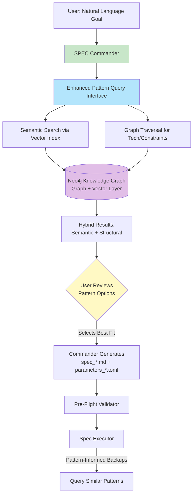
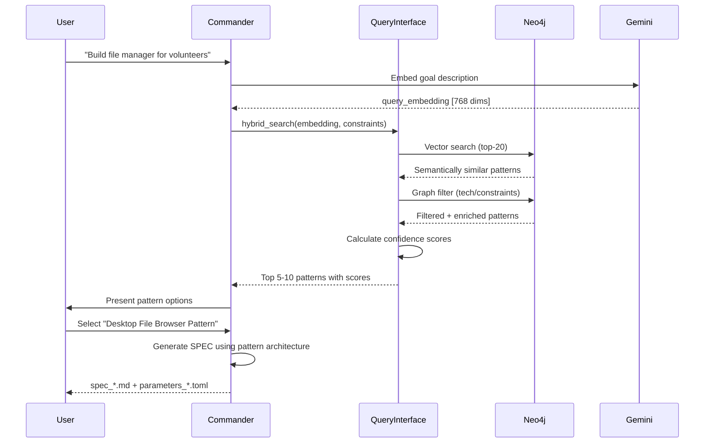

# Vector Knowledge Graph Architecture

**Version:** 1.0  
**Date:** 2026-01-07  
**Purpose:** Technical specification and design documentation for semantic vector search enhancement to the Neo4j architectural pattern knowledge graph

---

## Table of Contents

1. [Executive Summary](#executive-summary)
2. [Problem Statement](#problem-statement)
3. [Architecture Overview](#architecture-overview)
4. [Configuration Decisions](#configuration-decisions)
5. [Technical Specifications](#technical-specifications)
6. [Implementation Phases](#implementation-phases)
7. [Query Patterns](#query-patterns)
8. [Performance Targets](#performance-targets)
9. [Integration Points](#integration-points)
10. [Troubleshooting Guide](#troubleshooting-guide)
11. [Future Enhancements](#future-enhancements)

---

## Executive Summary

This document specifies the enhancement of the existing Neo4j knowledge graph with semantic vector search capabilities using Neo4j 5.x vector indexes and Gemini embeddings. The enhancement enables natural language pattern discovery while preserving current structural query capabilities.

**Key Goals:**
- Enable natural language goal descriptions to find relevant patterns
- Support semantic similarity matching beyond exact keyword matches
- Maintain backward compatibility with existing structural queries
- Integrate pattern discovery into SPEC Commander workflow
- Provide pattern-informed spec generation

**Critical Insight:** The original architecture had patterns queried AFTER spec generation (validation only). The corrected architecture queries patterns BEFORE spec generation, allowing patterns to inform and guide spec structure.

---

## Problem Statement

### Current Limitations

The existing knowledge graph uses structured Cypher queries which excel at:
- Exact technology stack matching
- Constraint-based filtering
- Requirement type classification
- Proven pattern discovery (by stars)

However, it cannot handle:
- **Natural language goal descriptions** - "Build a file manager for volunteers"
- **Semantic similarity** - Finding event-driven patterns when user says "real-time updates"
- **Fuzzy requirement matching** - User doesn't know exact terminology
- **Conceptual relationships** - Patterns that solve similar problems with different technologies

### Use Case Example

**Current Approach (Structural Only):**
```python
# User must know exact terms
patterns = query.recommend_patterns(
    requirement_type="data_management",
    domain="file_system",
    technologies=["typescript", "react"]
)
```

**Enhanced Approach (Semantic + Structural):**
```python
# User describes in natural language
patterns = query.find_patterns_semantic(
    goal="Build a file browser application for volunteers to manage documents",
    tech_preferences=["typescript", "react"]
)
# Returns: patterns semantically similar to goal + filtered by tech stack
```

---

## Architecture Overview

### Corrected Architecture Diagram



### Critical Flow Change

**Old (Incorrect):**
```
User Goal → Generate SPEC → Validate Against Patterns → Execute
```

**New (Correct):**
```
User Goal → Query Patterns → User Reviews → Select Pattern → 
Generate Pattern-Informed SPEC → Validate → Execute with Pattern Backups
```

### Hybrid Query Strategy



---

## Configuration Decisions

### Decision 1: Embedding Scope

**Question:** What should be embedded? All patterns or filtered subset?

**Decision:** Embed all patterns initially, filter by confidence in queries

**Rationale:**
- Current pattern count <500, embedding cost is minimal
- Provides maximum flexibility for different query types
- Allows cross-pattern discovery without pre-filtering
- Can adjust filtering thresholds without regenerating embeddings

**Implementation:**
```python
# Embed everything
for pattern in all_patterns:
    embedding = generate_embedding(pattern)
    pattern['embedding'] = embedding

# Filter in queries
def hybrid_search(query, min_confidence='medium'):
    results = vector_search(query, top_k=20)
    filtered = [r for r in results if r.confidence in ['high', 'medium']]
    return filtered[:10]
```

### Decision 2: Query Strategy

**Question:** How should semantic and structural queries be balanced?

**Decision:** Use semantic similarity to pull up candidates, then examine structures with user to determine best fit

**Workflow:**
1. **Semantic Search:** Cast wide net with vector similarity (top 20 candidates)
2. **Graph Filter:** Apply technology/constraint filters (narrow to 10-15)
3. **Confidence Scoring:** Rank by composite score (semantic + metadata)
4. **User Review:** Present top 5-10 patterns for manual selection
5. **User Selects:** Human examines graph structures and picks best fit

**Rationale:**
- Semantic search finds conceptually relevant patterns
- Graph filtering ensures technical feasibility
- User review provides domain expertise and context
- Combines AI pattern matching with human judgment

**Query Pattern:**
```cypher
// Step 1: Semantic search (broad)
CALL db.index.vector.queryNodes('pattern_embeddings', 20, $query_embedding) 
YIELD node AS p, score

// Step 2: Graph structure filter (narrow)
MATCH (p)-[:USES]->(t:Technology)
WHERE p.stars > 5000
  AND t.name IN $required_techs
WITH p, score, collect(t.name) AS techs

// Step 3: Enrich for user review (inform)
OPTIONAL MATCH (p)-[:REQUIRES]->(c:Constraint)
OPTIONAL MATCH (r:Requirement)-[:SOLVED_BY]->(p)

RETURN p.name AS pattern,
       p.reasoning AS why_it_works,
       score AS semantic_match,
       p.stars AS proven_success,
       techs AS tech_stack,
       collect(DISTINCT c.rule) AS constraints,
       r.domain AS solves_domain
ORDER BY score DESC
LIMIT 10
```

### Decision 3: Update Strategy

**Question:** How should embeddings be updated when patterns change?

**Decision:** Batch regeneration with versioning, triggered by pattern extraction runs

**Triggers:**
- Weekly pattern extraction (new patterns added)
- Manual pattern updates (reasoning/description changed)
- Embedding model upgrades (new version deployed)

**Versioning:**
```python
pattern.update({
    'embedding': embedding_vector,
    'embedding_model': 'text-embedding-004',
    'embedding_version': '2026-01',
    'embedding_date': datetime.now().isoformat()
})
```

**Migration Strategy:**
- Old embeddings remain valid until regenerated
- Version check allows gradual migration
- Can compare old vs new embeddings for quality assessment

### Decision 4: Integration Depth

**Question:** Should semantic search be optional or default?

**Decision:** Always use hybrid (semantic + structural) by default

**Modes:**
- **hybrid (default):** Semantic search + graph filtering (recommended)
- **semantic_only:** Vector search without constraints (discovery mode)
- **structural_only:** Traditional Cypher queries (backward compatibility/debugging)

**Rationale:**
- Hybrid provides best of both worlds
- Semantic-only useful for exploration ("what else exists?")
- Structural-only maintains backward compatibility
- Default to hybrid to ensure semantic benefits are always used

**API:**
```python
class EnhancedPatternQueryInterface:
    def find_patterns_for_spec(self, spec_dict, mode='hybrid'):
        if mode == 'hybrid':
            return self._hybrid_search(spec_dict)
        elif mode == 'semantic_only':
            return self._semantic_search(spec_dict)
        elif mode == 'structural_only':
            return self._structural_search(spec_dict)
```

### Decision 5: Performance

**Question:** What are the latency requirements and optimization strategy?

**Decision:** Latency not critical for testing; optimize when pattern count grows

**Current Phase (testing with <500 patterns):**
- No quantization needed
- Standard vector index sufficient
- Target: <100ms vector search, <200ms hybrid query
- Focus on accuracy over speed

**Future Phase (production with 1000+ patterns):**
- Enable vector quantization (bit or int8)
- Consider approximate nearest neighbor (ANN) tuning
- Target: <150ms hybrid query even at scale

**Performance Monitoring:**
```python
@timed
def hybrid_search(query_embedding, constraints):
    start = time.time()
    results = vector_search(query_embedding)  # Should be <100ms
    filtered = graph_filter(results, constraints)  # Should be <100ms
    log_performance('hybrid_search', time.time() - start)
    return filtered
```

### Decision 6: Cross-Pattern Discovery

**Question:** Should semantic search find conceptually similar patterns without shared technologies?

**Decision:** Yes, definitely enable cross-pattern discovery

**Use Cases:**
- **Alternative architectures:** Find event-driven patterns whether using Kafka, RabbitMQ, or Redis Streams
- **Conceptual similarity:** Discover patterns that solve similar problems with different tech stacks
- **Learning exploration:** "Show me all approaches to real-time data processing"
- **Innovation discovery:** Find novel patterns outside user's known tech ecosystem

**Query Mode:**
```cypher
// Cross-pattern discovery (no tech constraints)
CALL db.index.vector.queryNodes('pattern_embeddings', 15, $query_embedding)
YIELD node AS p, score
WHERE score > 0.7  // High semantic similarity only

OPTIONAL MATCH (p)-[:USES]->(t:Technology)
OPTIONAL MATCH (similar:Pattern)-[:USES]->(t)
WHERE similar <> p

RETURN p.name AS pattern,
       score AS conceptual_similarity,
       p.reasoning AS architectural_approach,
       collect(DISTINCT t.name) AS tech_stack,
       collect(DISTINCT similar.name) AS tech_related_patterns
ORDER BY score DESC
```

**Example Discovery:**
```
Query: "event-driven architecture for file processing"

Semantic Finds:
- Kafka Stream Processing (score: 0.89)
- RabbitMQ Message Queue (score: 0.85)
- Redis Pub/Sub Pattern (score: 0.82)
- WebSocket Real-time Updates (score: 0.78)
- Server-Sent Events (score: 0.75)

User sees: Multiple architectural approaches to event-driven systems,
not just exact tech stack matches
```

### Decision 7: Pattern Confidence in Results

**Question:** Should semantic search results include pattern confidence scoring?

**Decision:** Yes, use composite confidence score for Constitutional validation

**Scoring Formula:**
```python
composite_score = (
    0.4 * semantic_similarity +      # Vector search score (0-1)
    0.3 * confidence_value +         # Pattern metadata: high=1.0, medium=0.7, low=0.4
    0.3 * normalized_stars           # Proven success: min(stars/50000, 1.0)
)

recommendation = (
    "high" if composite_score > 0.7 else
    "medium" if composite_score > 0.5 else
    "low"
)
```

**Components Explained:**
- **Semantic Similarity (40%):** How well the pattern matches the user's goal description
- **Pattern Confidence (30%):** Pattern extraction quality (high/medium/low from knowledge graph)
- **Proven Success (30%):** GitHub stars normalized (50k+ stars = maximum)

**Integration with Constitution:**
- Article IV validation uses confidence scores to assess feasibility
- Pre-flight checks require minimum confidence threshold
- Low confidence patterns trigger collaborative review mode

**Score Interpretation:**
```
Score Range    | Recommendation | Validation Action
---------------|----------------|------------------
0.7 - 1.0      | HIGH          | Auto-approve feasibility
0.5 - 0.7      | MEDIUM        | Flag for user review
0.0 - 0.5      | LOW           | Require justification
```

---

## Technical Specifications

### Embedding Configuration

**Model Selection:**
- **Primary:** Gemini `text-embedding-004`
- **Dimensions:** 768
- **Cost:** Free tier (aligned with existing Gemini LLM usage)
- **Quality:** Good for technical text, proven in similar applications

**Input Text Composition:**
```python
def create_embedding_text(pattern):
    """Concatenate key fields for embedding"""
    components = [
        pattern['name'],
        pattern['reasoning'],
        pattern.get('description', ''),
        f"Stars: {pattern['stars']}"  # Include popularity signal
    ]
    return " | ".join(filter(None, components))
```

**Storage Schema:**
```cypher
// Pattern node properties
(p:Pattern {
    name: string,
    reasoning: string,
    confidence: string,
    stars: integer,
    source_repo: string,
    // NEW PROPERTIES:
    embedding: list<float>,           // 768-dimensional vector
    embedding_model: string,          // "text-embedding-004"
    embedding_version: string,        // "2026-01"
    embedding_date: datetime          // ISO 8601 timestamp
})
```

### Vector Index Configuration

**Neo4j Vector Index:**
```cypher
CREATE VECTOR INDEX pattern_embeddings
FOR (p:Pattern)
ON p.embedding
OPTIONS {
    indexConfig: {
        `vector.dimensions`: 768,
        `vector.similarity_function`: 'cosine',
        `vector.quantization.enabled`: false
    }
}
```

**Index Parameters:**
- `vector.dimensions`: 768 (matches Gemini embedding size)
- `vector.similarity_function`: 'cosine' (standard for text embeddings)
- `vector.quantization.enabled`: false (not needed for <1000 patterns)

**Future Optimization (at 1000+ patterns):**
```cypher
OPTIONS {
    indexConfig: {
        `vector.dimensions`: 768,
        `vector.similarity_function`: 'cosine',
        `vector.quantization.enabled`: true,
        `vector.quantization.type`: 'bit'  // or 'int8'
    }
}
```

### Query Performance Targets

| Operation | Target | Measurement Point |
|-----------|--------|-------------------|
| Embedding generation | <50ms | Gemini API call |
| Vector search (top-20) | <100ms | Neo4j vector index |
| Graph filtering | <50ms | Cypher constraints |
| Confidence scoring | <10ms | Python computation |
| **Total hybrid query** | **<200ms** | End-to-end |

**Monitoring:**
```python
class PerformanceTracker:
    def __init__(self):
        self.metrics = defaultdict(list)
    
    def log_timing(self, operation, duration_ms):
        self.metrics[operation].append(duration_ms)
        if duration_ms > THRESHOLD[operation]:
            logger.warning(f"{operation} exceeded threshold: {duration_ms}ms")
    
    def get_percentiles(self, operation):
        values = sorted(self.metrics[operation])
        return {
            'p50': values[len(values)//2],
            'p95': values[int(len(values)*0.95)],
            'p99': values[int(len(values)*0.99)]
        }
```

### Confidence Scoring Implementation

```python
class ConfidenceScorer:
    # Scoring weights (configurable)
    WEIGHTS = {
        'semantic': 0.4,
        'confidence': 0.3,
        'stars': 0.3
    }
    
    # Pattern confidence mapping
    CONFIDENCE_VALUES = {
        'high': 1.0,
        'medium': 0.7,
        'low': 0.4
    }
    
    # Stars normalization threshold
    STARS_MAX = 50000
    
    def calculate_composite_score(self, pattern, semantic_score):
        """Calculate weighted composite confidence score"""
        
        # Normalize stars (0-1 range)
        stars_normalized = min(pattern['stars'] / self.STARS_MAX, 1.0)
        
        # Map confidence string to value
        confidence_value = self.CONFIDENCE_VALUES[pattern['confidence']]
        
        # Calculate weighted sum
        composite = (
            semantic_score * self.WEIGHTS['semantic'] +
            confidence_value * self.WEIGHTS['confidence'] +
            stars_normalized * self.WEIGHTS['stars']
        )
        
        return {
            'composite_score': composite,
            'recommendation': self._get_recommendation(composite),
            'breakdown': {
                'semantic_match': semantic_score,
                'pattern_confidence': pattern['confidence'],
                'proven_success': pattern['stars'],
                'normalized_stars': stars_normalized
            }
        }
    
    def _get_recommendation(self, score):
        if score > 0.7:
            return 'high'
        elif score > 0.5:
            return 'medium'
        else:
            return 'low'
```

---

## Implementation Phases

### Phase 1: Core Semantic Layer (Week 1)

**Deliverables:**
1. `embedding_generator.py` - Gemini API wrapper
2. `vector_index_setup.cypher` - Index creation script
3. `generate_pattern_embeddings.py` - Batch embedding script
4. `test_vector_search.py` - Validation tests

**Success Criteria:**
- All existing patterns have embeddings
- Vector index created successfully
- Basic vector search works
- Performance targets met (<100ms searches)

### Phase 2: Hybrid Query Interface (Week 2)

**Deliverables:**
1. Enhanced `pattern_query_interface.py` with semantic methods
2. `hybrid_query_builder.py` - Query composition
3. `confidence_scorer.py` - Scoring logic
4. `test_hybrid_queries.py` - Integration tests

**Success Criteria:**
- Hybrid search combines semantic + structural correctly
- Confidence scores are sensible
- User review format is clear
- Edge cases handled gracefully

### Phase 3: Commander Integration (Week 3)

**Deliverables:**
1. Updated `Spec_Commander.md` workflow
2. `commander_integration.py` - Simplified interface
3. Updated `exe_template.md` - Pattern-informed backups
4. `COMMANDER_INTEGRATION_GUIDE.md` - Documentation

**Success Criteria:**
- Commander queries patterns before spec generation
- User review step works smoothly
- Generated SPECs reflect selected patterns
- Backup suggestions are relevant

### Phase 4: Cross-Pattern Discovery (Week 4)

**Deliverables:**
1. `pattern_relationships.py` - Conceptual similarity
2. `pattern_clusters.py` - Clustering logic
3. Enhanced query methods in interface
4. `CROSS_PATTERN_GUIDE.md` - Documentation

**Success Criteria:**
- Semantic similarity without tech constraints works
- Clustering identifies pattern families
- Discovery queries return relevant alternatives
- Learning paths are coherent

---

## Query Patterns

### Pattern 1: Basic Semantic Search

**Use Case:** Find patterns matching natural language goal

```python
from pattern_query_interface import PatternQueryInterface

interface = PatternQueryInterface()

# User describes goal in natural language
result = interface.find_patterns_semantic(
    goal="Build a file manager application for volunteers",
    top_k=10
)

for pattern in result['patterns']:
    print(f"{pattern['name']}: {pattern['composite_score']:.2f}")
    print(f"  Semantic: {pattern['semantic_match']:.2f}")
    print(f"  Confidence: {pattern['pattern_confidence']}")
    print(f"  Stars: {pattern['proven_success']}")
```

### Pattern 2: Hybrid Search with Constraints

**Use Case:** Semantic search filtered by technical requirements

```python
result = interface.find_patterns_hybrid(
    goal="Real-time chat application with message history",
    constraints={
        'technologies': ['nodejs', 'websocket'],
        'deployment_type': 'web',
        'min_stars': 5000
    },
    top_k=5
)

# Present to user for review
print("\nTop Patterns for Your Goal:")
for i, p in enumerate(result['patterns'], 1):
    print(f"\n{i}. {p['name']} (Score: {p['composite_score']:.2f})")
    print(f"   Technologies: {', '.join(p['tech_stack'])}")
    print(f"   Why it matches: {p['reasoning']}")
    print(f"   Source: {p['source_repo']}")
```

### Pattern 3: Cross-Pattern Discovery

**Use Case:** Find alternative architectural approaches

```python
# Find conceptually similar patterns without tech filtering
result = interface.discover_alternatives(
    goal="Event-driven file processing system",
    include_different_tech=True,
    min_similarity=0.7,
    top_k=15
)

# Group by architectural approach
approaches = {}
for pattern in result['patterns']:
    approach = pattern['architectural_style']
    if approach not in approaches:
        approaches[approach] = []
    approaches[approach].append(pattern)

print("Alternative Architectural Approaches:")
for approach, patterns in approaches.items():
    print(f"\n{approach}:")
    for p in patterns:
        print(f"  - {p['name']} ({', '.join(p['tech_stack'])})")
```

### Pattern 4: Pattern-Informed SPEC Generation

**Use Case:** Commander generates SPEC using selected pattern

```python
# Step 1: User goal
user_goal = "Build a desktop application for managing research papers"

# Step 2: Query patterns
candidates = interface.find_patterns_hybrid(
    goal=user_goal,
    constraints={'deployment_type': 'desktop'},
    top_k=5
)

# Step 3: Present to user
print("Select a pattern to base your SPEC on:")
for i, p in enumerate(candidates['patterns'], 1):
    print(f"{i}. {p['name']} - {p['reasoning']}")

# Step 4: User selects (e.g., option 2)
selected_pattern = candidates['patterns'][1]

# Step 5: Generate SPEC informed by pattern
spec_template = interface.generate_spec_from_pattern(
    goal=user_goal,
    pattern=selected_pattern
)

# Returns:
# - Recommended tech stack from pattern
# - Architectural constraints from pattern
# - Similar patterns for backup methods
# - Validation criteria based on pattern success metrics
```

### Pattern 5: Finding Similar Patterns for Backups

**Use Case:** Executor needs backup methods when primary fails

```python
# During execution, primary method fails
current_pattern = "electron_desktop_app"

# Find similar patterns for backup approaches
backups = interface.find_similar_patterns(
    pattern_name=current_pattern,
    similarity_threshold=0.75,
    exclude_same_tech=False,  # Include similar tech for easier transition
    top_k=3
)

print("Suggested Backup Approaches:")
for backup in backups['patterns']:
    print(f"\n{backup['name']}")
    print(f"  Similarity: {backup['similarity']:.2f}")
    print(f"  Key Difference: {backup['difference_from_primary']}")
    print(f"  Why it might work: {backup['backup_rationale']}")
```

---

## Performance Targets

### Latency Targets

```
Operation                          | Target  | P95 Limit
-----------------------------------|---------|----------
Embedding generation (Gemini)      | 50ms    | 100ms
Vector similarity search (Neo4j)   | 80ms    | 150ms
Graph traversal filter (Neo4j)     | 40ms    | 80ms
Confidence scoring (Python)        | 10ms    | 20ms
User review formatting (Python)    | 10ms    | 20ms
-----------------------------------|---------|----------
Total hybrid query (end-to-end)    | 190ms   | 370ms
```

### Throughput Targets

```
Pattern Count | Queries/Second | Notes
--------------|----------------|---------------------------
100           | 50+            | No optimization needed
500           | 30+            | Current target range
1,000         | 20+            | Enable quantization
5,000         | 10+            | Consider sharding/caching
```

### Accuracy Targets

```
Metric                                  | Target
----------------------------------------|--------
Relevant patterns in top-10             | >80%
High confidence patterns are relevant   | >90%
User selects from top-5                 | >70%
Semantic match beats keyword match      | >60%
```

**Measurement Method:**
- User feedback surveys after pattern selection
- A/B testing: semantic vs structural queries
- Manual review of top-10 results for sample queries
- Track user selection patterns (do they pick top results?)

---

## Integration Points

### Integration 1: SPEC Commander

**Location:** `__SPEC_Engine/_Commander_SPEC/Spec_Commander.md`

**Modified Workflow:**
```markdown
## Step 3: Query Pattern Knowledge Graph (NEW)

Before generating the SPEC, query the knowledge graph for relevant patterns:

1. Embed the user's goal description
2. Execute hybrid search (semantic + structural)
3. Present top 5-10 patterns to user
4. User reviews and selects best fit pattern

**Output:** Selected pattern informs SPEC structure, tech stack, and constraints
```

**Integration Code:**
```python
# In Commander implementation
from pattern_query_interface import PatternQueryInterface

def generate_spec(user_goal, user_context):
    # NEW: Query patterns first
    interface = PatternQueryInterface()
    patterns = interface.find_patterns_hybrid(
        goal=user_goal,
        constraints=extract_constraints(user_context),
        top_k=5
    )
    
    # Present to user for selection
    selected_pattern = present_pattern_options(patterns)
    
    # Generate SPEC informed by pattern
    spec = create_spec_from_pattern(user_goal, selected_pattern)
    
    return spec
```

### Integration 2: Pre-Flight Validator

**Location:** `__SPEC_Engine/_templates/exe_template.md` Section 1.1-1.10

**Enhanced Validation:**
```markdown
### Section 1.4a: Validate Pattern Feasibility (NEW)

If SPEC references a pattern from knowledge graph:

1. Retrieve pattern metadata (confidence, stars, constraints)
2. Calculate composite confidence score
3. Check if SPEC aligns with pattern constraints
4. Verify tech stack matches pattern recommendations

**Halt conditions:**
- Pattern confidence score < 0.5 (medium threshold)
- SPEC violates critical pattern constraints
- Tech stack incompatible with pattern requirements
```

### Integration 3: Executor Backup Suggestions

**Location:** Executor during runtime

**Pattern-Informed Backups:**
```python
# During execution, when step fails
def generate_backup_suggestions(failed_step, current_pattern):
    interface = PatternQueryInterface()
    
    # Find similar patterns for alternative approaches
    similar = interface.find_similar_patterns(
        pattern_name=current_pattern,
        top_k=3
    )
    
    # Extract backup approaches from similar patterns
    backups = []
    for pattern in similar:
        backup = {
            'method': pattern['primary_approach'],
            'rationale': f"Used successfully in {pattern['source_repo']}",
            'tech_stack': pattern['technologies'],
            'confidence': pattern['composite_score']
        }
        backups.append(backup)
    
    return backups
```

### Integration 4: Constitutional Compliance

**Location:** `__SPEC_Engine/_Constitution/constitution.md` Article IV

**Enhanced Validation:**
```markdown
### Section 4.1a: Pattern Feasibility Check (NEW)

Pre-flight validation MUST include pattern feasibility assessment:

1. If SPEC references a knowledge graph pattern:
   - Verify pattern exists and is current
   - Check pattern confidence score (must be ≥ 0.5)
   - Validate SPEC aligns with pattern constraints

2. If SPEC does not reference a pattern:
   - Query knowledge graph for similar patterns
   - Flag if no patterns found (unknown territory)
   - Suggest patterns for consideration

**Failure Actions:**
- Low pattern confidence (<0.5): Warn and request justification
- No matching patterns: Flag as experimental SPEC
- Pattern constraints violated: Halt with specific violations
```

---

## Troubleshooting Guide

### Issue 1: Vector Index Not Found

**Symptoms:**
```
Neo4jError: Unknown index: pattern_embeddings
```

**Diagnosis:**
```cypher
// Check if index exists
SHOW INDEXES
YIELD name, type, labelsOrTypes, properties
WHERE name = 'pattern_embeddings'
```

**Solutions:**
1. Create index: Run `vector_index_setup.cypher`
2. Wait for index to come online: `CALL db.awaitIndexes()`
3. Verify Neo4j version: Must be 5.x+ for vector support

### Issue 2: Embeddings Not Generated

**Symptoms:**
```python
# Vector search returns no results
# Or: Property 'embedding' does not exist
```

**Diagnosis:**
```cypher
// Check how many patterns have embeddings
MATCH (p:Pattern)
RETURN count(p) AS total,
       count(p.embedding) AS with_embeddings,
       count(p) - count(p.embedding) AS missing_embeddings
```

**Solutions:**
1. Run embedding generation: `python generate_pattern_embeddings.py`
2. Check Gemini API key: `echo $GEMINI_API_KEY`
3. Review logs for API errors: `tail -f logs/embedding_generation.log`

### Issue 3: Semantic Search Returns Irrelevant Results

**Symptoms:**
- Top results don't match query intent
- Low confidence scores across board
- User never selects from top-5

**Diagnosis:**
```python
# Test specific query
result = interface.find_patterns_semantic(
    goal="Your test query",
    top_k=20  # Get more results to inspect
)

# Examine scores
for p in result['patterns']:
    print(f"{p['name']}: semantic={p['semantic_match']:.3f}, composite={p['composite_score']:.3f}")
```

**Solutions:**
1. **Tune scoring weights:** Adjust `WEIGHTS` in `ConfidenceScorer`
2. **Re-embed with better text:** Improve `create_embedding_text()` to include more context
3. **Filter by domain:** Add domain-specific filters to queries
4. **Check embedding quality:** Verify embeddings are diverse (not all similar)

### Issue 4: Slow Query Performance

**Symptoms:**
- Hybrid queries taking >500ms
- Timeout errors
- User experience degraded

**Diagnosis:**
```python
# Enable performance tracking
interface = PatternQueryInterface(enable_profiling=True)
result = interface.find_patterns_hybrid(goal="test")

# Check timing breakdown
print(interface.get_performance_breakdown())
# Output: embedding=45ms, vector_search=350ms, graph_filter=120ms
```

**Solutions:**
1. **Vector search slow (>200ms):**
   - Enable quantization: `vector.quantization.enabled: true`
   - Reduce top-k: Query top-10 instead of top-20
   - Check index is online: `CALL db.awaitIndexes()`

2. **Graph filter slow (>100ms):**
   - Add indexes on Technology.name: `CREATE INDEX tech_name FOR (t:Technology) ON (t.name)`
   - Simplify constraint filters
   - Cache common filter results

3. **Embedding generation slow (>100ms):**
   - Batch multiple queries together
   - Cache query embeddings
   - Use async Gemini calls

### Issue 5: Out of Memory During Embedding Generation

**Symptoms:**
```
MemoryError: Unable to allocate array
```

**Diagnosis:**
```python
# Check pattern count
count_query = "MATCH (p:Pattern) RETURN count(p) AS total"
# If >1000 patterns and loading all at once = problem
```

**Solutions:**
1. **Batch processing:**
```python
BATCH_SIZE = 100

for i in range(0, total_patterns, BATCH_SIZE):
    batch = get_patterns_batch(offset=i, limit=BATCH_SIZE)
    embeddings = generate_embeddings_batch(batch)
    save_embeddings(embeddings)
```

2. **Stream processing:**
```python
for pattern in stream_patterns():
    embedding = generate_embedding(pattern)
    save_embedding_immediate(pattern.id, embedding)
```

### Issue 6: API Rate Limits (Gemini)

**Symptoms:**
```
google.api_core.exceptions.ResourceExhausted: 429 Too Many Requests
```

**Solutions:**
1. **Add rate limiting:**
```python
from time import sleep
from ratelimit import limits, sleep_and_retry

@sleep_and_retry
@limits(calls=60, period=60)  # 60 calls per minute
def generate_embedding(text):
    return gemini_embed(text)
```

2. **Implement exponential backoff:**
```python
def generate_with_retry(text, max_retries=3):
    for attempt in range(max_retries):
        try:
            return gemini_embed(text)
        except ResourceExhausted:
            wait = (2 ** attempt) * 1  # 1s, 2s, 4s
            sleep(wait)
    raise Exception("Max retries exceeded")
```

3. **Cache embeddings:**
```python
from functools import lru_cache

@lru_cache(maxsize=1000)
def generate_embedding_cached(text):
    return gemini_embed(text)
```

---

## Future Enhancements

### Enhancement 1: Multi-Modal Embeddings

**Concept:** Embed not just text, but code snippets, architecture diagrams, and API signatures

**Implementation:**
```python
def create_multimodal_embedding(pattern):
    text_embedding = embed_text(pattern['reasoning'])
    code_embedding = embed_code(pattern['code_sample'])
    diagram_embedding = embed_image(pattern['architecture_diagram'])
    
    # Weighted combination
    combined = (
        0.5 * text_embedding +
        0.3 * code_embedding +
        0.2 * diagram_embedding
    )
    return combined
```

**Benefits:**
- Find patterns by architectural diagram similarity
- Match code structure patterns
- Discover API design patterns

### Enhancement 2: Temporal Embeddings

**Concept:** Track how patterns evolve over time, find trending vs stable patterns

**Implementation:**
```cypher
(p:Pattern {
    embedding_history: [
        {date: "2024-01", embedding: [...]},
        {date: "2025-01", embedding: [...]},
        {date: "2026-01", embedding: [...]}
    ]
})
```

**Benefits:**
- Detect pattern evolution
- Find stable vs rapidly changing patterns
- Track technology adoption trends

### Enhancement 3: Federated Pattern Discovery

**Concept:** Query multiple knowledge graphs (internal patterns + public pattern databases)

**Implementation:**
```python
def federated_search(goal):
    internal = search_internal_kg(goal)
    github_awesome = search_awesome_lists(goal)
    academic = search_research_papers(goal)
    
    # Merge and re-rank
    return merge_results([internal, github_awesome, academic])
```

### Enhancement 4: Active Learning from User Selections

**Concept:** Learn from which patterns users select to improve future rankings

**Implementation:**
```python
def track_user_selection(query, presented_patterns, selected_pattern):
    # Store selection event
    log_selection(query, selected_pattern)
    
    # Periodically retrain ranking model
    if selection_count > 100:
        retrain_confidence_scorer()
```

### Enhancement 5: Pattern Composition

**Concept:** Suggest combining multiple patterns for complex goals

**Implementation:**
```python
def suggest_pattern_composition(complex_goal):
    # Decompose goal into sub-goals
    sub_goals = decompose_goal(complex_goal)
    
    # Find pattern for each sub-goal
    patterns = [find_pattern(sg) for sg in sub_goals]
    
    # Suggest composition
    return {
        'primary_pattern': patterns[0],
        'augment_with': patterns[1:],
        'integration_points': find_integration_points(patterns)
    }
```

---

## Quick Reference

### Essential Commands

```bash
# Generate embeddings for all patterns
python generate_pattern_embeddings.py

# Create vector index
cypher-shell < vector_index_setup.cypher

# Test vector search
python test_vector_search.py

# Run hybrid query example
python example_semantic_query.py
```

### Essential Queries

```cypher
-- Check embedding coverage
MATCH (p:Pattern)
RETURN count(p) AS total,
       count(p.embedding) AS with_embeddings;

-- Test vector search
CALL db.index.vector.queryNodes('pattern_embeddings', 5, $embedding)
YIELD node, score
RETURN node.name, score;

-- Verify index status
SHOW INDEXES YIELD name, state WHERE name = 'pattern_embeddings';
```

### Essential Python

```python
# Quick semantic search
from pattern_query_interface import PatternQueryInterface

interface = PatternQueryInterface()
results = interface.find_patterns_semantic(
    goal="Your natural language goal",
    top_k=5
)

# Print top results
for p in results['patterns']:
    print(f"{p['name']}: {p['composite_score']:.2f}")
```

---

**Version History:**
- v1.0 (2026-01-07): Initial architecture documentation based on design discussion

**Maintenance:**
- Update when implementation reveals new patterns or issues
- Revise configuration decisions based on production experience
- Add troubleshooting entries as new issues discovered

---

**End of Architecture Documentation**
